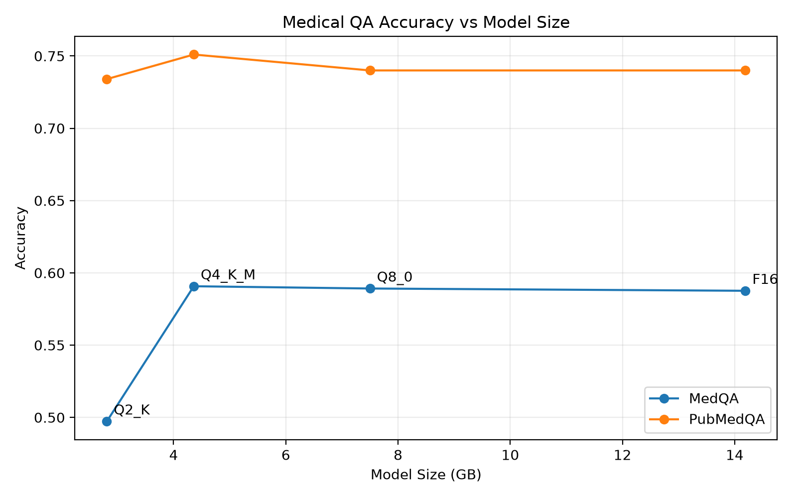
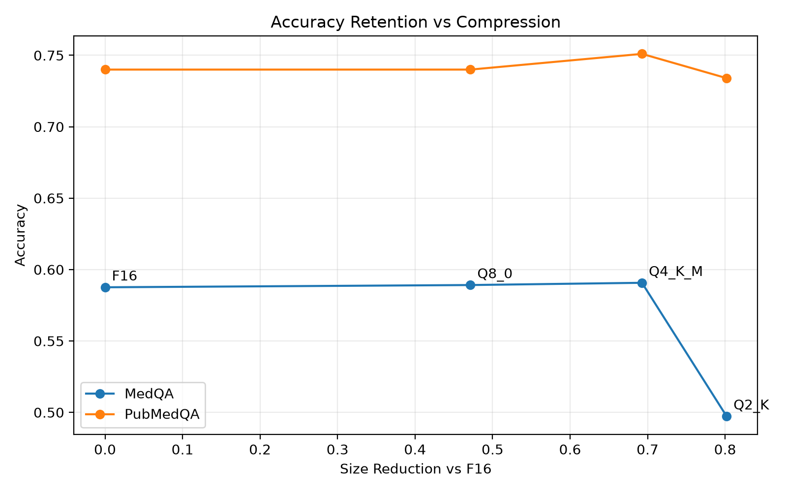
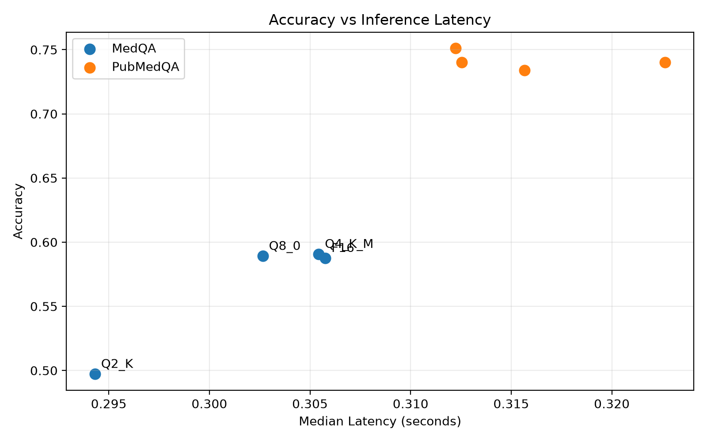

# LLM Quantization Tradeoffs

Benchmarks how much accuracy you actually lose when you quantize an LLM down for cheaper/faster inference. Qwen2.5-7B-Instruct is served locally through [Ollama](https://ollama.com) at four precision levels — F16, Q8_0, Q4_K_M, and Q2_K — and evaluated on two medical QA datasets: [MedQA](https://huggingface.co/datasets/GBaker/MedQA-USMLE-4-options-hf) (USMLE-style 4-option multiple choice) and [PubMedQA](https://huggingface.co/datasets/qiaojin/PubMedQA) (yes/no/maybe questions answered against a research abstract).

**Key finding:** Q4_K_M matches (and slightly beats) full-precision accuracy on both benchmarks while being **69% smaller** and running at **~1.9x the throughput**. Q2_K holds up fine on the easier yes/no/maybe task but its accuracy falls off a cliff on multi-choice reasoning — so how much you can compress a model depends a lot on the task, not just the model.

## Results

| Model | Precision | Size (GB) | MedQA Accuracy | PubMedQA Accuracy | MedQA Tokens/sec |
|---|---|---|---|---|---|
| qwen2.5-7b-f16 | F16 | 14.19 | 58.8% | 74.0% | 82.5 |
| qwen2.5-7b-q8 | Q8_0 | 7.50 (−47%) | 58.9% | 74.0% | 118.9 |
| **qwen2.5-7b-q4** | **Q4_K_M** | **4.36 (−69%)** | **59.1%** | **75.1%** | **154.0** |
| qwen2.5-7b-q2 | Q2_K | 2.81 (−80%) | 49.7% | 73.4% | 230.5 |

<p align="center">
  <br>
  <em>Accuracy holds flat from F16 down through Q4_K_M, then drops sharply at Q2_K on MedQA. PubMedQA barely moves.</em>
</p>

<p align="center">
  <br>
  <em>Compression is basically free up to ~70% size reduction — then MedQA accuracy falls off a cliff past that point.</em>
</p>

<p align="center">
  <br>
  <em>Median latency differences are small at this scale; the real gains from quantization show up in throughput (tokens/sec) rather than latency.</em>
</p>

Each prediction is also checked for output-format compliance (did the model return a clean answer label or something the parser had to fall back on) — that stayed at 94–100% across every quantization level, so the accuracy drop at Q2_K is a real reasoning/correctness issue, not a formatting one.

## How it works

1. Each quantized model is registered with Ollama via its own `Modelfile`.
2. MedQA and PubMedQA are pulled from Hugging Face and normalized into a shared question/choices/answer schema.
3. Every example is sent through a fixed system prompt (temperature 0, fixed seed) asking for just the answer label — no reasoning, no extra text.
4. Predictions are parsed with a strict regex first, falling back to a looser one if the model didn't follow the format exactly, so format compliance is tracked separately from correctness.
5. Accuracy, latency (median/p95), and throughput are aggregated per model/dataset, then merged across all four models into `results/quantization_summary.json` for plotting.

## Repo structure

```
llm-quant-tradeoffs/
├── models/                     # GGUF weights + Modelfiles (gitignored)
├── plots/                      # Generated comparison charts
├── results/
│   ├── qwen2.5-7b-f16/         # Per-model predictions + summaries
│   ├── qwen2.5-7b-q8/
│   ├── qwen2.5-7b-q4/
│   ├── qwen2.5-7b-q2/
│   └── quantization_summary.json
├── src/
│   ├── data.py                 # Loads & normalizes MedQA / PubMedQA
│   ├── schemas.py              # Pydantic models: QuestionExample, ModelConfig, Prediction
│   ├── inference.py            # Prompting, Ollama calls, output parsing
│   ├── metrics.py              # Accuracy, latency percentiles, format compliance
│   ├── benchmark.py            # Runs one model config across both datasets
│   ├── analysis.py             # Merges per-model summaries into quantization_summary.json
│   └── plots.py                # Generates the comparison charts
├── Modelfile.f16 / .q8 / .q4 / .q2
└── run_benchmark.py            # Entry point: runs all 4 models × both datasets
```

## Running it

**Requirements:** [Ollama](https://ollama.com) running locally, GGUF weights for Qwen2.5-7B-Instruct at each quantization level.

```bash
# Register each quantized model with Ollama
ollama create qwen2.5-7b-f16 -f Modelfile.f16
ollama create qwen2.5-7b-q8   -f Modelfile.q8
ollama create qwen2.5-7b-q4   -f Modelfile.q4
ollama create qwen2.5-7b-q2   -f Modelfile.q2

# Run the full benchmark (all 4 models x 2 datasets)
python run_benchmark.py

# Merge results and regenerate plots
python -m src.analysis
python -m src.plots
```

Results land in `results/<model>/{medqa,pubmedqa}_{predictions,summary}.json`, merged into `results/quantization_summary.json` for cross-model comparison.
